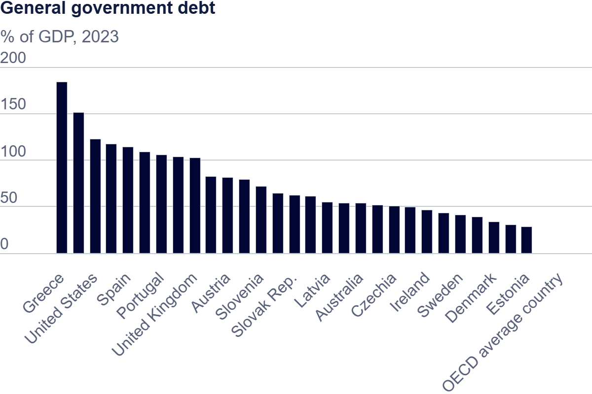

## **Visualizing Government Debt**

### **Visualizing Government Debt Using Tableau part 1**

### **Visualizing Government Debt Using Tableau part 2**

<noscript></noscript><object class='tableauViz'  style='display:none;'><param name='host_url' value='https%3A%2F%2Fpublic.tableau.com%2F' /> <param name='embed_code_version' value='3' /> <param name='site_root' value='' /><param name='name' value='Book1_17307568320840&#47;GovernmentDebt' /><param name='tabs' value='no' /><param name='toolbar' value='yes' /><param name='static_image' value='https:&#47;&#47;public.tableau.com&#47;static&#47;images&#47;Bo&#47;Book1_17307568320840&#47;GovernmentDebt&#47;1.png' /> <param name='animate_transition' value='yes' /><param name='display_static_image' value='yes' /><param name='display_spinner' value='yes' /><param name='display_overlay' value='yes' /><param name='display_count' value='yes' /><param name='language' value='en-US' /><param name='filter' value='publish=yes' /></object>
  

### **Visualizing Government Debt Using Tableau part 3**

<noscript></noscript><object class='tableauViz'  style='display:none;'><param name='host_url' value='https%3A%2F%2Fpublic.tableau.com%2F' /> <param name='embed_code_version' value='3' /> <param name='path' value='shared&#47;74MWGNRHQ' /> <param name='toolbar' value='yes' /><param name='static_image' value='https:&#47;&#47;public.tableau.com&#47;static&#47;images&#47;74&#47;74MWGNRHQ&#47;1.png' /> <param name='animate_transition' value='yes' /><param name='display_static_image' value='yes' /><param name='display_spinner' value='yes' /><param name='display_overlay' value='yes' /><param name='display_count' value='yes' /><param name='language' value='en-US' /><param name='filter' value='publish=yes' /></object>
                

When comparing the efficiency of a heatmap and a bar chart in visualizing data, it largely comes down to the amount of data one wants to include. The data used for the second and third visualizations is taken from the Organization for Economic Co-operation and Development (OECD) and includes the yearly general government debts of 35 countries within a 1995-2019 time frame. The first visualization encompasses most of this data, including the debts of all countries with the exception of Columbia from 1995 to 2019. A heat map allows the inclusion of a large amount of data and is ideal for portraying an overall trend or pattern.

With this contrast of warm orange and blue, readers are able to quickly identify which countries have higher government debts and see a trend of most countries debts increasing by the year. On the other hand, the third visualization focuses on a subset of the data. Looking at the debts of the USA only, from 2006 to 2016, I chose a bar chart to represent this data for it contains fewer variables. A bar chart allows for each individual value to stand out on its own, and I was able to easily bring attention to the the 2008 government debt for the chart to portray the 2008 financial crisis' impact on U.S. debt. I used gray to color all the bars with exception of the 2008 bar being a bright red. 
